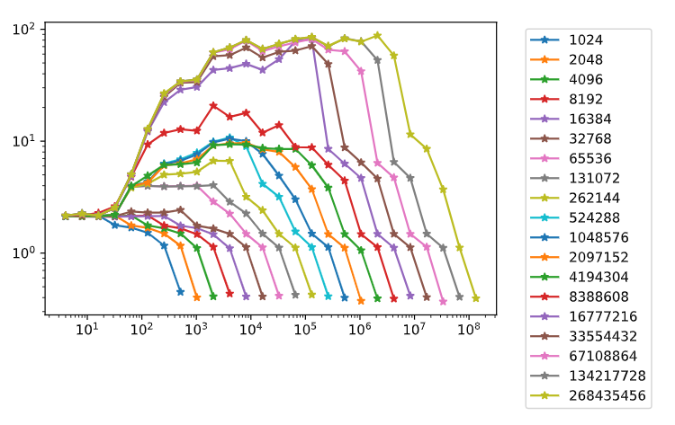

# Exercise 1 - Pointer chasing

## a) Code understanding

[See lecture 03, slide 11]

**Q:  What happens in the main experiment?**

A:  The main experiment performs *strided* memory accesses, i.e. do memory reads every $s$'th
    integer from the array. ($s$ divides the array length $n$) 
    The experiment is done such that there is a total of $n$ reads.

**Q:  What is the purpose of the empty experiment and why do we measure its time?**

A:  We only wish to time memory access, and not other operations such as additions or control 
    flow. The empty experiment with the same loop then serves as a baseline. 
    Note that to avoid the compiler from optimizing away the loop, values are added to a 
    global variable inside the loop.

```cpp
double read_time = (time_per_experiment-time_per_emptyexperiment)/e.operations()*1e9;
```

**Q:  Why do we include the loop `for (int k=0; k<s; k++)`?**

A:  A single `while(i!=0)` performs $n/s$ reads. Performing this loop $s$ times results in 
    $n$ reads, irrespective of $s$.


## b) Running the code

Aggressive optimization (`/Og` and `/Ox` for *MSVC*, `-O2` and `-O3` for *Clang*) resulted in in negative (MSVC) and very small numbers (Clang) respectively. Lower levels of optimization worked as expected, though MSVC requires optimization to be disabled entirely (`/Od`). 

For the benchmark, we thus went with `-O1 -march=native` and Clang.

*NOTE:* Instead of globally lowering optimization levels, certain functions can be annotated with a pragma.


## c) Log-log plot




## d) Analysis

*[We follow Lecture03.pdf, "Exploring the Memory Hierarchy".]*

CPU specifications:

| Type | Size |
| ---- | ---- |
| Core speed | 3492.08 MHz |
| Cache line | 64 Bytes |
| L1 Data | 32 KBytes/Core |
| L2 | 256 KBytes/Core |
| L3 | 8 MBytes |
| DRAM | 32 GBytes |

An `int` array of size $n$ is `N = sizeof(int) * n` Bytes long, where `sizeof(int) == 4`.In the memory hierarchy above, this translates to:

- L1: N <= 32768
  ```
  32768, 2.12956, 2.13152, 2.11982, 2.13644, 2.34862, 2.29491, 2.29721, 2.42588, 1.758, 1.65436, 1.48124, 1.1264, 0.408677
  ```
- L2: N <= 262144
  ```
  262144, 2.12642, 2.14465, 2.14219, 2.20499, 3.83459, 4.16905, 5.0106, 5.12391, 5.31577, 6.67505, 6.66311, 3.18334, 2.41179, 1.48313, 1.11532, 0.424508
  ```
- L3: N <= 8388608
  ```
  8388608, 2.14405, 2.18357, 2.28245, 2.61271, 4.79959, 9.34196, 11.8379, 12.7577, 12.3943, 20.7594, 16.4891, 17.8781, 11.9064, 13.9103, 8.86916, 8.79527, 6.1418, 4.44052, 1.47779, 1.12763, 0.39093
  ```
- Memory
  ```
  268435456, 2.16555, 2.24473, 2.16943, 2.54578, 5.03337, 12.8516, 26.7203, 34.1864, 35.4376, 62.2576, 68.6825, 80.1634, 66.6466, 74.0574, 81.7801, 85.2145, 70.9536, 82.6319, 77.3715, 87.9293, 58.1795, 11.5027, 8.53954, 3.70502, 1.11905, 0.393715
  ```

For smaller strides, memory bandwidth is sufficent and pipeline stalls is the limiting factor. For larger strides, memory bandwidth becomes the limiting factor and we can see the transfer rate of memory. Choosing the strides with the higest latency then resulted in:

- L1 cache: ~7 clock cycles (~2ns)
- L2 cache: ~25 clock cycles (~7ns)
- L3 cache: ~71 clock cycles (~20ns)
- Main memory: ~310 cycles (~87ms)


# Exercise 2 - Peak Performance